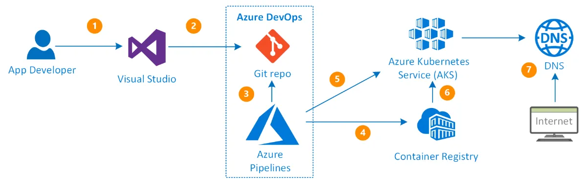

# AKS Enterprise WTH - Building ADO Pipelines

*This hack challenge is an addendum to the [AKS Enterprise What-The-Hack](https://microsoft.github.io/WhatTheHack/039-AKSEnterpriseGrade/) and assumes a working baseline cluster has been created and the application is operational.*

## Introduction

In this challenge, we'll implement an ADO pipeline based on our Kubernetes manifests, utilizing Helm and Azure CLI tasks to create our container image and release our images to our AKS cluster.

## Resource Folders

- [**app**](./app/) - Contains the "api" and "web" source code for your pipeline build step.
- [**helm**](./helm/) - Contains a base Helm chart to use for deploying the new release. *This is optional, and you may use whatever deployment methodology desired.*

## Concepts

### Basic Container Image Flow

In a typical CI/CD pipeline for non-container workloads, a code commit triggers an automated build and test process that validates the changes. If these tests pass, the system packages the artifact and deploys it to a staging environment for further acceptance testing. Finally, the artifact is released to production either automatically or after manual approval.

In a container-based CI/CD pipeline, a code commit triggers an image build (using something like a Dockerfile), followed by automated testing. If the tests pass, the image is pushed to a registry and then deployed using an orchestration tool (such as Kubernetes), ensuring a consistent runtime environment.

**In summary:**

1. Code is pushed to a git repository, triggering a build.
2. Triggered pipeline retrieves commits and then builds and pushes that image to a repository
3. Tag, build ID, or Digest is retrieved from output of build.
4. Deployment manifest is updated/patched with the new image tag and pushed to the container runtime.

*([Image Source](https://tharaka-madhusanka.medium.com/how-to-deploy-net-4-x-web-app-docker-image-to-azure-web-app-container-using-azure-devops-pipeline-b5afb1193525))*

### Image Tags vs Digest

Referencing a container image by its digest guarantees you pull the exact same bits every time - locking in consistency, security, and caching efficiency - at the cost of added management overhead, manual updates for patches, and less human‑friendly identifiers.

**Benefits**

- **Immutability & Consistency** - Always fetches the identical image, never a moved or overwritten tag.
- **Reproducibility** - Ensures builds and deployments can be replayed byte‑for‑byte.
- **Security** - Prevents tag hijacking and confirms you’re using the image you’ve scanned or signed.

**Risks**

- **Manual Updates** - Doesn't auto‑pick security fixes or minor patches (e.g., "latest") - you must update digests yourself.
- **Operational Overhead** - Managing long hashes across configs adds complexity.

**Examples**
- **Image Tag** - `docker.io/wth/api:latest`
- **Digest** - `docker.io/wth/api@sha256:dd7808d8792c9841d0b460122f1acf0a2dd1f56404f8d1e56298048885e4`

## Description

The challenge does require the use of the Kubernetes manifest files that were built in previous challenges for use in our ADO pipeline. Ideally, if you can leverage Helm, it would simplify the process The goal is to create a CICD pipeline that, at a minimum:

1. Retrieves the source code from a Git repositiory
2. Builds and creates an image from the source code
3. Pushes the image (or images) to a registry (e.g., Azure Container Registry)
4. Updates your Kubernetes deployments to use the new image(s) tag/digest

## Building from Source

The source code for "API" and "web" are included in this repository. These files are currently on your workstation, but they will need to be pushed to a remote Git repository for use by the pipeline. ADO files is probably the easiest option, but another repository is fine, as long as you can authenticate to it from your pipeline. 

There are multiple ways to build the image. While you are welcome to use `docker build`, remember that Azure Container Registry has options to build from source (and does not require that docker is installed on the runner).

## Pushing a Release

Once you have authenticated to your cluster from your pipeline, there are multiple ways to push the changes. So far you have (typically) been using `kubectl apply`, supplying a deployment file with a specific tag, and while this may work, can be tedious and cumbersome with many files. 

Using [Kustomize](https://kubernetes.io/docs/tasks/manage-kubernetes-objects/kustomization/) is also an option, as this still requires the use of building a patch file. Another option is using `kubectl patch`, but this is not recommended, as this is more for "on-the-fly" updates and does not keep versions of releases.

Using Helm would generally be recommended, as this allows for more dynamic (templated) use of our manifests and the ability to tokenize parameters for our build (e.g., image repository, tag name, version). A basic [Helm](./helm/) chart structure has been supplied for you.

## Success Criteria

*Participants can decide if they would like to release both "web" and "API" as a single pipeline, or split them out into multiple pipelines.*

- Source code has been pushed to a remote Git repository
- An ADO pipeline has been created that build upon a commit to a branch
- Any changes to the web application, for example, are reflected on the updated deployment to the cluster (e.g., a minor HTML change in the web app)
- The images published are referenced by a digest (preferred) or unique build ID tag
- The pipeline completes multiple builds without error

## Hints

- While a docker build task can be used in your pipeline, there are easier appraoches using the Azure CLI for image creation.
- Almost all Azure CLI commands return information about the object created, and using `-o tsv --query SOMEPROPERTY` is helpful for retrieving specific values to be stored as a variable.
- Helm requires a properly-configured Kubeconfig file.

## Learning Resources

- [Build and deploy to Azure Kubernetes Service with Azure Pipelines](https://learn.microsoft.com/en-us/azure/aks/devops-pipeline?tabs=cli)
- [Quickstart: Develop on Azure Kubernetes Service (AKS) with Helm](https://learn.microsoft.com/en-us/azure/aks/quickstart-helm?tabs=azure-cli)